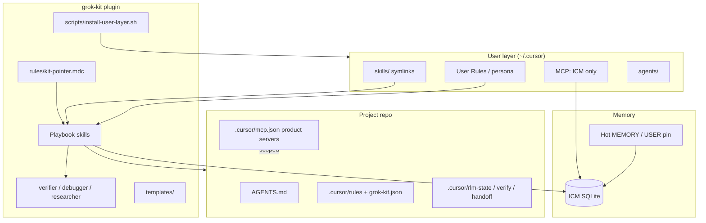

# grok-kit

[](https://github.com/ashishpatill/grok-kit/blob/main/LICENSE)
[](https://github.com/ashishpatill/grok-kit)

Personal harness kit for **Cursor** (interactive coding) and **Grok Build** (terminal agent). Same plugin tree: playbook skills, thin-parent orchestration, cost-aware routing, ICM memory, and per-repo `grok-kit apply`. It does not replace either host. It is the layer that turns their built-in powers into a repeatable loop instead of burning context and forgetting decisions between chats.

Local checkout may live at any path (for example `cursor-kit`). Plugin id is always `grok-kit`.

## How grok-kit uses Cursor and Grok Build

**Cursor** is the interactive coding host. **Grok Build** is the terminal / headless coding host. **Grok 4.5** and **Composer 2.5** are models you pick *inside* those hosts. grok-kit is none of those. It is the shared plugin tree that makes each host's built-in powers fire on purpose:

- **On demand** — playbooks are `SKILL.md` files. They load when you invoke them, not on every message.
- **Thin always-on** — rules and `AGENTS.md` stay short and byte-stable so the host can KV-cache the prompt prefix.
- **Cheap where review is enough** — custom agents pin Composer; `/cost-check` picks Optimize For.
- **One CLI** — `grok-kit` (symlink from `scripts/grok-kit.mjs`) runs apply, verify, hygiene, rsi, and the rest with or without an IDE.

Official Cursor Marketplace and xAI catalog listings are still remaining (`docs/publish.md`). A clone works in both hosts today.

### Cursor (interactive coding source of truth)

Cursor is the daily driver. grok-kit fills Cursor's agent surface instead of inventing a second IDE.

| Cursor power | How grok-kit uses it |
|--------------|----------------------|
| **Agent Skills** (`skills/*/SKILL.md` + scripts, loaded when invoked) | Playbooks live under `skills/`. You type `/plan-execute`, `/cost-check`, `/orchestrate-rlm`, `/rsi`, and so on. Bulk stays **out** of the always-on prompt. |
| **Custom agents** (kit `agents/`; install copies to `~/.cursor/agents/`) | `verifier`, `debugger`, `researcher` pin **Composer / cheap**. Explore and review do not inherit the parent's Intelligence setting. |
| **Rules** (user + project `.mdc`, `alwaysApply`) | Three complementary always-on files, all short: kit pointer (`rules/kit-pointer.mdc`), user `~/.cursor/rules/grok-kit.mdc`, generated `.cursor/rules/grok-kit-project.mdc`. No timestamps, no learned dumps. Cursor can KV-cache the prefix. |
| **`AGENTS.md`** | One screen: platform boundary (Cursor SoT), skill names, ICM/secrets rule. Bulk stays in skills. |
| **MCP** | User-global slimmed to ICM after `install --i-consent`. Product servers (browser, DB, deploy, Tell) stay **project-scoped** so unused tool schemas are not injected into every chat. |
| **Hooks** (`hooks/hooks.json`) | `sessionStart`: `grok-kit apply --if-missing` plus a one-line flagship hint. `stop`: memory reminder. Fail-open; `additional_context` stays short. |
| **Plugins** (`.cursor-plugin/plugin.json`, local `~/.cursor/plugins/local/`) | `./scripts/install-user-layer.sh --i-consent` symlinks this repo as the `grok-kit` plugin so Cursor discovers skills, agents, and hooks without copying the tree. |
| **Optimize For / Models pool** | `/cost-check` is the matrix: Auto Balance for implement, Cost or Composer for ask/nits/verify, Intelligence only for stubborn debug. Prefer Grok 4.5 / Composer 2.5 for routine work. |
| **Plan / Agent / Ask / Debug modes** | Skills assume Agent for implement, Plan before multi-unit work, Ask for read-only. The kit does not fight the mode picker. |
| **Explore vs extra search subagents** | Prefer Cursor's built-in Explore. `/orchestrate-rlm` is depth-1, summary-only, and only when the parent cannot do the work. |
| **Host canvas** (if your Cursor build has it) | `/visualise` emits mermaid the host can render. A screenshot is not proof; Tell-proof repos use `tell_proof_verify`. |
| **Tell MCP** (project-scoped, never user-global) | Tell-proof profile: `ui-contract.json` + `tell_proof_verify`. Never auto-apply `tell_apply`. |

Cursor Cloud Agents, Tab, and Browser are host features. grok-kit does not wrap them as the default loop. Desktop Cursor remains SoT; an optional long-run companion is rare/eval-only (`docs/companion-agent.md`).

### Grok Build (terminal / headless agent)

[Grok Build plugins](https://github.com/xai-org/grok-build/blob/main/crates/codegen/xai-grok-pager/docs/user-guide/09-plugins.md) are a directory of `skills/`, `agents/`, `hooks/hooks.json`, optional `plugin.json`, plus optional `commands/`, `.mcp.json`, and `.lsp.json`. grok-kit ships the first four. One clone is a valid Grok plugin **and** a CLI you can run when there is no IDE.

| Grok Build power | How grok-kit uses it |
|------------------|----------------------|
| **Plugin skills** (`skills/*/SKILL.md`) | Same playbooks as Cursor. They appear in Grok's slash menu. Helper scripts live next to the skill (`skills/*/scripts/`). No duplicate `commands/` folder: `SKILL.md` is the shared format. |
| **Plugin agents** (`agents/`) | Same `verifier` / `debugger` / `researcher`. Cheap-model pins still apply when the host honors agent `model:` frontmatter. Qualified name is `grok-kit:verifier` if the short name collides. |
| **Plugin hooks** (`hooks/hooks.json`) | Same sessionStart apply-if-consent + stop memory stub. Plugin root resolves from the script path, `CURSOR_PLUGIN_ROOT`, or `GROK_PLUGIN_ROOT`. |
| **`plugin.json` metadata** | Root `plugin.json` (name, version, description) plus MIT + logo. Grok discovers components from the standard directories even without a manifest. |
| **`grok plugin install`** | Works from this repo **today**, listing or not: `grok plugin install /path/to/grok-kit --trust` or `grok plugin install ashishpatill/grok-kit --trust`. After an xAI catalog listing: `grok plugin install grok-kit --trust`. |
| **`grok inspect`** | Shows what loaded (skills, agents, hooks, MCP, `AGENTS.md`) and approximate token cost. That is why apply subsets features and always-on files stay tiny. |
| **Terminal CLI** | `./scripts/install-user-layer.sh --i-consent` puts `grok-kit` on `PATH` (`~/.local/bin/grok-kit` → `scripts/grok-kit.mjs`). Or run `node scripts/grok-kit.mjs` from the checkout. Apply, verify, hygiene, rsi, flagship all work with Cursor closed. |
| **Project files in the repo Grok is in** | `grok-kit apply` writes `.cursor/grok-kit.json`, a thin project rule, and `AGENTS.md` snippets. Grok already reads `AGENTS.md`; keep it one screen. |
| **No plugin-root `.mcp.json`** | Intentional. Product MCP stays project-scoped (`apply --write-mcp` only). `install-user-layer.sh` slims Cursor user MCP only. Grok Build should not inherit a bloated `~/.cursor/mcp.json`. |

### What the kit adds on top of both hosts

These are grok-kit, not Cursor or Grok builtins:

- **`grok-kit apply`** — detect the repo, enable a subset of features, write `.cursor/grok-kit.json` + a thin generated project rule.
- **`/cost-check` + token/KV notes** — host KV cache only works if the always-on prefix is stable. The kit keeps it stable.
- **ICM memory-sync / session-handoff** — human-gated writes; never silent User Rules edits.
- **`/rsi`** — review-before-ship (flagship + hygiene + prove-it). Does not merge.
- **Usage-learn (`--learn` / `--improve`)** — opt-in; names only; never auto-edits persona or skill bodies.

## What it fixes

Common failure modes this kit targets:

| Pain | Kit response |
|------|----------------|
| Ad-hoc agent chaos | Skills ladder + `/orchestrate-rlm` (thin parent, summary-only children, depth 1) |
| Expensive model misuse | `/cost-check` router matrix (Auto Balance default; pin cheap for explore/verify) |
| Session amnesia | ICM shared memory + `/memory-sync` / `/session-handoff` (human-gated writes) |
| Under-tooled repos | `grok-kit apply` detects the stack, bootstraps a thin layer, writes `.cursor/grok-kit.json` so only the useful kit features fire |
| "Is it green?" lies | `/watch-ci` uses GitHub merge state (conflicts → threads → failing checks); approval is a human wait |
| Fake-done claims | `/verify-aci` (doctor/launch/drive) + cheap `/rubric-verify` instead of a review swarm |
| Code drift / dead weight | `/code-hygiene` ranks stale and low-quality files; you read them and choose scrap, keep, or fix |
| Context bloat from MCP | Install slims user MCP to ICM-only; product servers stay project-scoped |
| Prompt prefix churn | Always-on rules stay short and byte-stable so Cursor can KV-cache them. Learned workflows stay in `grok-kit.json`, not in always-on `.mdc` files |

## How grok-kit cuts token usage

Cursor and Grok Build can reuse the **start** of the prompt (KV cache) on later turns only if those bytes did not change. grok-kit is built around that:

1. **Subset, not a dump.** `grok-kit apply` enables the features this repo needs. The rest of the kit loads when you type a slash skill, not on every message.
2. **Stable always-on prefix.** Generated `.cursor/rules/grok-kit-project.mdc` has no timestamps and no per-session text. `install --improve` will not rewrite it unless enabled features actually changed. That is the KV cache fix: one cached router instead of a new prefix every chat.
3. **MCP slim.** After `install --i-consent`, user-global MCP is ICM-only. Browser/DB/deploy/Tell schemas stay out of chats that do not need them.
4. **Cheap default routing.** `/cost-check`: Auto Balance for implement, Cost/Composer for ask and verify, Intelligence only for stubborn debug or novel architecture. Verifier/researcher agents pin Composer.
5. **Short returns.** `/orchestrate-rlm` children summarize (depth 1). Do not paste transcripts back into the parent.
6. **Short memory.** ICM holds long-tail facts. Keep hot MEMORY/USER small. Do not paste identity into always-on rules.

Run `/cost-check` before a large agent turn. Details: [`skills/cost-check/references/token-kv-cache.md`](skills/cost-check/references/token-kv-cache.md).

See [How grok-kit uses Cursor and Grok Build](#how-grok-kit-uses-cursor-and-grok-build) for the host mapping. Companion policy: [`docs/companion-agent.md`](docs/companion-agent.md).

## What's included

- Playbook skills: plan→execute, orchestration, cost, bootstrap, memory, handoff, flagship overview/visualise, code hygiene, rsi review-before-ship, harness refinement, usage learn, task routing, verify ACI, merge-state CI watch, rubric verify
- Specialist agents: `verifier`, `debugger`, `researcher` (pin cheap for explore/verify)
- Cost routing: Optimize For matrix; prefer Cursor Models pool (Grok 4.5 / Composer 2.5) for routine work
- Memory bridge: ICM for long-tail store; keep hot MEMORY/USER short; no silent identity mutation
- MCP slim pattern: user-global = ICM; archive/restore helpers; product servers in project snippets
- User-layer install script: agents, hooks, skill symlinks, plugin symlink, `~/.local/bin/grok-kit` dispatcher
- Stack templates: Next.js/Clerk/Neon, research-Python, agentic-framework, Tell (tell-proof) profiles
- Auto-apply: plugin + user rule + sessionStart hook run `grok-kit apply --if-missing` so every git repo gets an adapted kit layer

### Skills

| Skill | When to use |
|-------|-------------|
| `/cost-check` | Before large runs, high spend, or choosing Cost / Balance / Intelligence |
| `/plan-execute` | Ambiguous multi-file work: plan first, then implement |
| `/orchestrate-rlm` | Multi-hop / multi-package work; thin parent, summary-only children |
| `/project-bootstrap` | Detect + adapt: `grok-kit apply` writes `grok-kit.json` and a thin project rule; `bootstrap` is the low-level copier |
| `/verify-aci` | Prove the artifact: project `doctor` / `launch` / one `drive` |
| `/rubric-verify` | Score a short repo-grounded checklist against the diff |
| `/watch-ci` | PR merge-state (status-once). Not a green checkbox list |
| `/route-task` | Map bug / feature / investigate / ship / hygiene onto kit skills. Not sticky |
| `/memory-sync` | Seed or update ICM from hot memory; propose (never silent) identity exports |
| `/session-handoff` | End a deep session; write handoff + ICM `handoff-<slug>` |
| `/flagship` | Session start/end: overview + visualise so you stay on top of the project |
| `/overview` | Compiled status: git, kit profile, handoff, recent commits |
| `/visualise` | Mermaid picture of that status; host canvas if available |
| `/code-hygiene` | Rank stale/unused/low-quality code; you decide scrap / fix / keep. Never auto-delete |
| `/rsi` | Review before ship: flagship + hygiene + rubric + verify-aci + watch-ci |
| `/refine-harness` | After a trajectory: ≤3 evidence-backed harness patches, human approve |
| `/usage-learn` | After `install --learn`: observe local skill/workflow usage; adapt `grok-kit.json` only with `--improve` or `learn apply --i-consent` |
| `/skill-curator-manual` | Periodic skill inventory / merge proposals (manual apply) |

### Agents

| Agent | Role |
|-------|------|
| `verifier` | Readonly acceptance: verify-aci + rubric judgment + watch-ci; pin Composer |
| `debugger` | Localize → minimal fix → verify; stop after two failed hypotheses |
| `researcher` | Readonly exploration; summarize-only returns; pin Composer |

Ladder: Skill → single Agent → Plan→Agent → parallel Task (≤3-5, depth 1) → Best-of-N rare.

## Quickstart

```bash
git clone https://github.com/ashishpatill/grok-kit.git
cd grok-kit
./scripts/install-user-layer.sh --i-consent
# grok-kit → ~/.local/bin/grok-kit (add ~/.local/bin to PATH if needed)
grok-kit check
# or from the checkout:
node scripts/grok-kit.mjs check
```

In Cursor: Developer: Reload Window, then try:

```text
/cost-check
/plan-execute
/project-bootstrap
/verify-aci
/watch-ci
```

Confirm the local plugin id `grok-kit` appears under plugins / Customize, and slash skills resolve.

Grok Build (terminal, same clone):

```bash
grok plugin install /path/to/grok-kit --trust
# or: grok plugin install ashishpatill/grok-kit --trust
grok-kit check
# from the checkout if grok-kit is not on PATH:
node scripts/grok-kit.mjs check
```

Reload the Grok plugins list (`r` in the Plugins tab, or a new session). Skills should show in the slash menu. Official catalog listing is still remaining (`docs/publish.md`).

## Setup

### 1. Install the user layer

Option A: install script (recommended)

```bash
./scripts/install-user-layer.sh --i-consent
# or: grok-kit install --i-consent
```

Install **refuses** (exit 78) unless you pass `--i-consent` or type `I CONSENT` on a TTY. That consent covers:

- Copy agents into `~/.cursor/agents/`
- Copy user rule `~/.cursor/rules/grok-kit.mdc` (per-repo apply on later sessions)
- Merge stop + sessionStart hooks into `~/.cursor/hooks.json` (preserves other events)
- Symlink each skill into `~/.cursor/skills/`
- Symlink the plugin to `~/.cursor/plugins/local/grok-kit`
- Symlink `~/.local/bin/grok-kit` so skills work in any repo
- Slim user MCP to ICM-only (backs up existing `~/.cursor/mcp.json` first; skip with `--skip-mcp-slim`)
- Create a stub `~/.cursor/permissions.json` if missing
- `grok-kit apply` on the current git repo now, and on other git repos at sessionStart when they lack `.cursor/grok-kit.json`

**Not included unless you pass extra flags:**

- `--learn` — record local grok-kit command / slash-skill **names** (no file contents) and write `.cursor/grok-kit-proposals.json`
- `--improve` — implies `--learn`; sessionStart may adapt **only** `.cursor/grok-kit.json` enabled features + learned workflow bullets. Never User Rules, persona, or kit `SKILL.md`

Recorded at `~/.cursor/grok-kit-consent.json`. Revoke: `grok-kit consent revoke` (stops background apply; does not delete project files already written).

Enabling the Cursor plugin **without** this install does not write `~/.cursor` or other repos. sessionStart will ask you to run `grok-kit install --i-consent`.

Option B: plugin symlink only (no user-layer consent, no auto-apply)

```bash
mkdir -p ~/.cursor/plugins/local
ln -sfn /path/to/grok-kit ~/.cursor/plugins/local/grok-kit

for d in /path/to/grok-kit/skills/*; do
  ln -sfn "$d" ~/.cursor/skills/"$(basename "$d")"
done
```

### 2. Shared memory (ICM)

Install and init per [`docs/icm-setup.md`](docs/icm-setup.md):

```bash
# put icm on PATH, then:
icm init --mode mcp
icm init --mode skill   # optional
```

Keep user-global MCP ICM-only ([`docs/mcp-snippets/user-mcp.icm-only.json`](docs/mcp-snippets/user-mcp.icm-only.json)). Product MCP (database, browser, payments, deploy) belongs in the project's `.cursor/mcp.json`. See [`docs/mcp-snippets/`](docs/mcp-snippets/).

Seed once (human-gated):

```bash
export HOT_MEMORY_FILE="$HOME/path/to/MEMORY.md"
export HOT_USER_FILE="$HOME/path/to/USER.md"
./scripts/seed-icm-from-memory.sh
# or invoke /memory-sync in Cursor
```

### 3. Reload and smoke-test

1. Command Palette → Developer: Reload Window
2. Customize → MCP should show `icm` only (add product servers per project as needed)
3. Try `/cost-check`, `/plan-execute`, `/memory-sync`

Machine-specific checklist for an already-applied host: [`docs/SETUP-STATUS.md`](docs/SETUP-STATUS.md).

### Runtime split

| Layer | Role |
|-------|------|
| Cursor | Interactive coding SoT. Skills, agents, rules, MCP, hooks, plugin. |
| Grok Build | Terminal / headless host. Same plugin tree + `grok-kit` CLI. |
| Grok 4.5 / Composer 2.5 | Models inside those hosts. `/cost-check` chooses when. |
| Hot memory pin | Short MEMORY/USER files |
| ICM | Long-tail preferences, routing, project topics, handoffs |
| Companion | Optional unattended/eval only. Not a third daily host. |

Full mapping: [How grok-kit uses Cursor and Grok Build](#how-grok-kit-uses-cursor-and-grok-build).

## Usage

### Day-to-day

1. Start with `/route-task` (bug / feature / investigate / ship / hygiene) or `/plan-execute` for ambiguous work
2. Before a large or expensive run, `/cost-check`
3. Multi-package or parallel units → `/orchestrate-rlm` (compile STATE.md with `state-tools`; children return summaries only)
4. New repo → `grok-kit apply --root .` (or `/project-bootstrap`). Replace `drive()` in `.cursor/verify/verify.sh`. Follow enabled features in `.cursor/grok-kit.json` only.
5. After implement → `/verify-aci` then `/rubric-verify` (defaults to `.cursor/verify/rubric.json`; auto-diff includes untracked files). If a PR is open → `/watch-ci` `--status-once`
6. Drift / dead code → `/code-hygiene`: read the ranked files, then scrap, keep, or fix. The compiler never deletes.
7. Before ship → `/rsi` (flagship + hygiene + prove-it). Merge only if asked.
8. End deep work → `/session-handoff`; durable facts → `/memory-sync` (propose, don't auto-apply)

### Orchestration ladder

```text
Skill  →  single Agent  →  Plan→Agent  →  parallel Task (≤3-5)  →  Best-of-N (rare)
```

Children stay depth 1. Prefer built-in Explore for search; pin cheap/Composer on verify and research agents. Never inherit Intelligence for those.

### Default routing

| Scenario | Optimize For |
|----------|----------------|
| Clarify / Q&A / nits | Cost or Composer 2.5 |
| Day-to-day implement | Balance (default) |
| Stubborn debug / novel architecture | Intelligence (only when needed) |
| Verify / research subagents | Pin Composer; never inherit Intelligence |

Full matrix: skill [`skills/cost-check/SKILL.md`](skills/cost-check/SKILL.md).

## Architecture



| Path | Purpose |
|------|---------|
| `skills/` | Playbook skills (slash commands) |
| `agents/` | `verifier`, `debugger`, `researcher` |
| `rules/` | Thin always-on kit pointer (persona stays in User Rules); background apply only after install consent |
| `hooks/` | sessionStart apply-if-missing **if consented** + optional usage-learn tick + stop memory stub |
| `templates/` | Stack profiles for apply/bootstrap, including tell-proof UI contract |
| `scripts/` | User-layer install, ICM seed, `kit-check.sh`, `grok-kit.mjs` dispatcher |
| `.cursor/verify/` | Kit ACI (`verify.sh`, feature-map, rubric) |
| `docs/` | ICM setup, MCP snippets, companion criteria, publish notes |
| `.cursor-plugin/plugin.json` | Cursor plugin manifest |
| `plugin.json` | Root metadata for Grok Build plugin discovery / catalogs |

## Configuration

Key knobs (no secrets in the kit):

| Knob | Where | Notes |
|------|-------|-------|
| Plugin path | `~/.cursor/plugins/local/grok-kit` | Symlink from clone |
| Skills path | `~/.cursor/skills/<name>` | Symlinks into kit `skills/` |
| User MCP | `~/.cursor/mcp.json` | ICM-only by default after install |
| MCP archive | `~/.cursor/mcp-servers.archived.json` | Former globals for project restore |
| Permissions | `~/.cursor/permissions.json` | Stub allowlist includes `icm` |
| User rules | `~/.cursor/rules/grok-kit.mdc` | Installed only after `--i-consent`; per-project router |
| Consent | `~/.cursor/grok-kit-consent.json` | User-layer + project-apply + optional MCP slim; `usageLearn` / `harnessImprove` only with `--learn` / `--improve`; `grok-kit consent revoke` |
| Usage log | `~/.cursor/grok-kit-usage.jsonl` | Written only after `--learn`; command/skill names, no secrets (override `GROK_KIT_USAGE_FILE`) |
| Proposals | `<repo>/.cursor/grok-kit-proposals.json` | ≤3 deterministic harness tweaks after `--learn` (override `GROK_KIT_PROPOSALS_FILE`) |
| Hooks | `~/.cursor/hooks.json` | sessionStart apply-if-missing after consent + stop memory stub (merged, not overwritten) |
| Hot pin paths | `HOT_MEMORY_FILE` / `HOT_USER_FILE` | For seed script |
| Project MCP | `<repo>/.cursor/mcp.json` | Product servers only when needed |

Never store API keys or tokens in ICM topics, rules, or handoff files.

## FAQ / Troubleshooting

**Slash skills don't appear**  
Reload the window. Confirm skill symlinks under `~/.cursor/skills/` and plugin at `~/.cursor/plugins/local/grok-kit`. Re-run `./scripts/install-user-layer.sh --i-consent`.

**Plugin not listed**  
Check the symlink target points at this clone. Legacy names `agent-kit` / `cursor-kit` under `plugins/local/` are removed by the install script.

**I need my old global MCP servers back**

```bash
cp ~/.cursor/mcp-servers.archived.json ~/.cursor/mcp.json
# or merge selected servers into a project's .cursor/mcp.json
# install also writes ~/.cursor/mcp.json.bak.grok-kit.<timestamp>
```

**ICM not found**  
Install the binary and run `icm init --mode mcp`. See [`docs/icm-setup.md`](docs/icm-setup.md).

**Does this work in Grok Build?**  
Yes. Same `skills/`, `agents/`, `hooks/hooks.json`, and `plugin.json`. Install from the clone with `grok plugin install /path/to/grok-kit --trust` (catalog listing is remaining). Put `grok-kit` on PATH with `./scripts/install-user-layer.sh --i-consent`, or run `node scripts/grok-kit.mjs`. Full mapping: [How grok-kit uses Cursor and Grok Build](#how-grok-kit-uses-cursor-and-grok-build).

**Should I run a detached companion daily?**  
No. Stay in Cursor for interactive work (or Grok Build in the terminal with the same kit). Companions are eval/unattended only ([`docs/companion-agent.md`](docs/companion-agent.md)).

**Does this replace User Rules / persona?**  
No. The kit pointer is thin; persona and policy live in User Rules. `/memory-sync` and `/refine-harness` propose changes; they do not silently rewrite identity. `/usage-learn` may adapt `.cursor/grok-kit.json` only after `install --improve` or `grok-kit learn apply --i-consent`.

**Will grok-kit watch how I work and change itself?**  
Only if you opt in. `install --learn` logs skill/workflow **names** locally and writes proposals. `install --improve` (or a one-shot `learn apply --i-consent`) can enable optional features you already use and pin a frequent workflow onto the generated project rule. It never rewrites User Rules or kit `SKILL.md`.

## Status / Roadmap

Honest status (see also [`docs/STATUS.md`](docs/STATUS.md) and [`docs/publish.md`](docs/publish.md)):

| Item | Status |
|------|--------|
| Local plugin via symlink / install script | Works today |
| Skills, agents, templates, ICM docs | In repo |
| Cursor Marketplace listing | Prep done; manual submit at [cursor.com/marketplace/publish](https://cursor.com/marketplace/publish) + review |
| Grok Build catalog | Prep done; PR to [xai-org/plugin-marketplace](https://github.com/xai-org/plugin-marketplace) with pinned `main` SHA |

Not in scope: becoming a full agent framework product, unsupervised User Rules / `SKILL.md` mutation, or marketing as a design-workflow kit. Consented `install --improve` may adapt `grok-kit.json` only.

## Contributing

This is a personal harness kit published for reuse. PRs that keep skills lean (bulk in `references/`), stay accurate to install scripts, and avoid vendor-name spam in docs are welcome.

1. Fork and branch from `main`
2. Keep playbook skills thin; put long procedures in `references/`
3. Match skill names and install behavior in any README/docs edits
4. Open a PR with a clear why

Progress / stop rules for maintainers: [`GOAL_AND_LOOP.md`](GOAL_AND_LOOP.md).

## License

[MIT](https://github.com/ashishpatill/grok-kit/blob/main/LICENSE) © 2026 Ashish P
