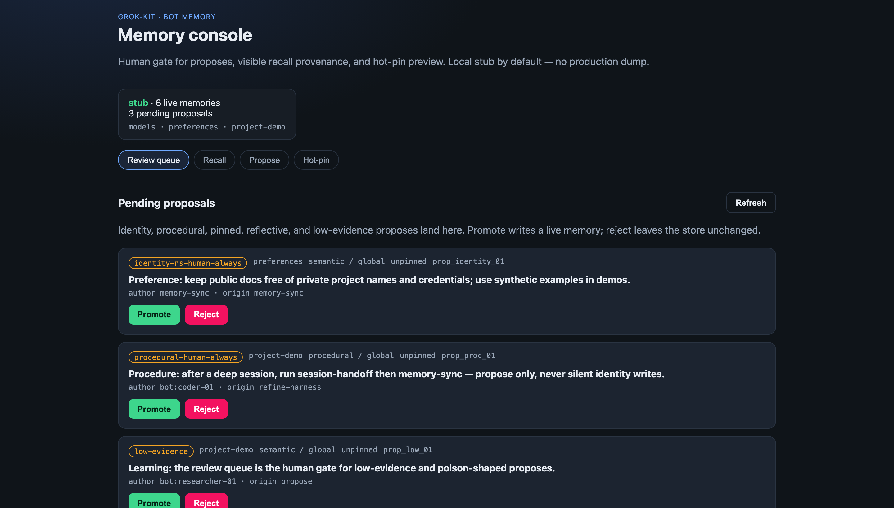
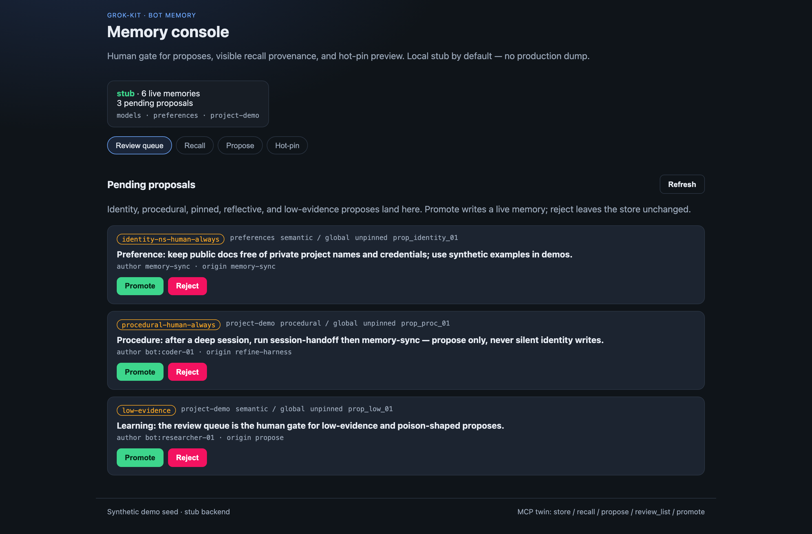
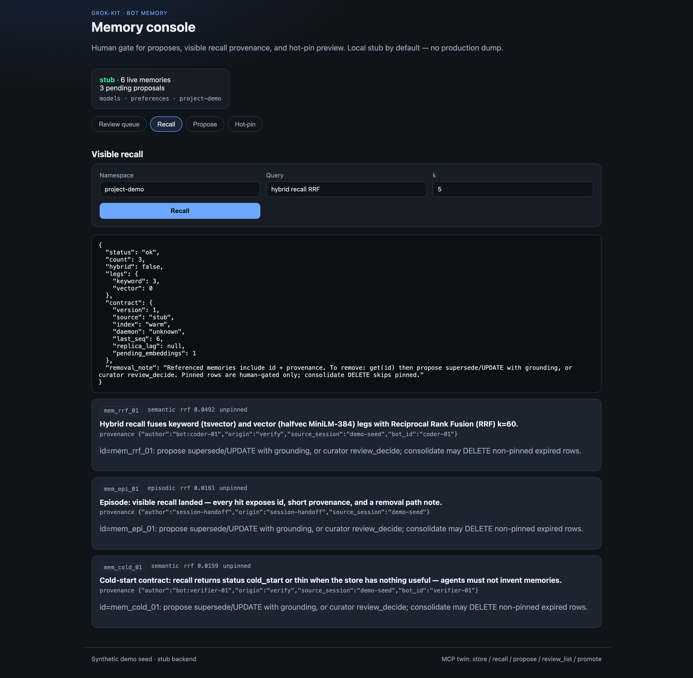
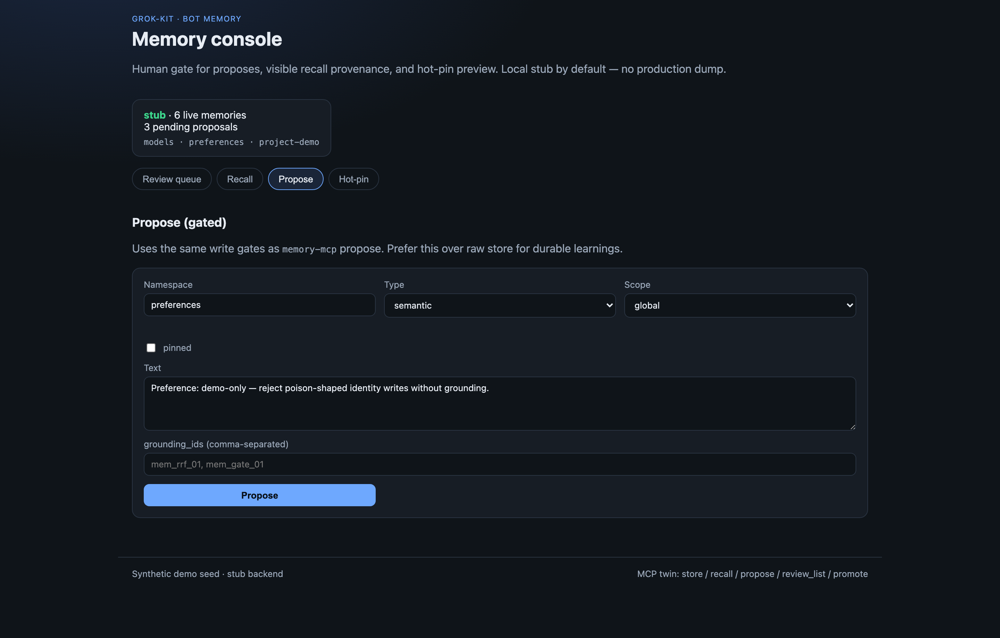
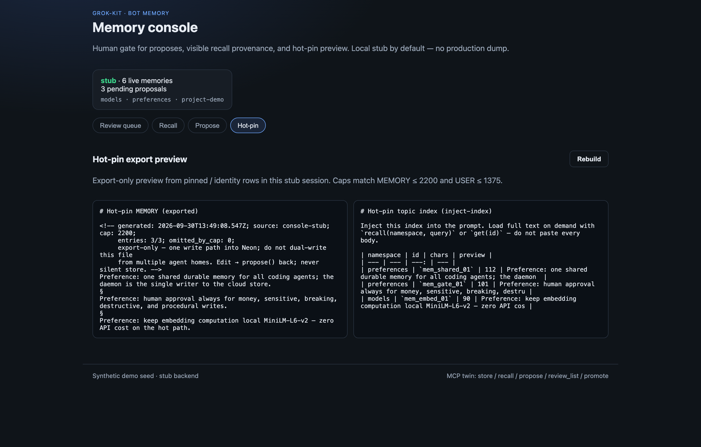

# Bot memory

Shared durable memory for coding agents in [grok-kit](../README.md).

One cloud-primary store (**Neon + pgvector**), an event-triggered daemon, MCP
tools bots already speak, and a local **human console** for the review gate.
Human approval stays mandatory for money, sensitive, breaking, destructive,
procedural, and identity writes. Agents propose; you promote or reject.

**Status (2026-09-30):** single-daemon bot memory is **usable** on `main`
(store / recall / propose / review / hot-pin / mirror export). Graph-of-bots
orchestration remains plan + scaffold — see [`docs/STATUS.md`](../docs/STATUS.md).



<p align="center"><em>Synthetic stub demo — no production memory text.</em></p>

## Try the console (synthetic, no Neon)

```bash
cd memory
npm install          # once
npm run console      # → http://127.0.0.1:7432
npm run console:smoke
npm run export:smoke
```

The console boots from [`console/fixtures/demo-seed.json`](console/fixtures/demo-seed.json)
(OSS-safe preferences and project-demo facts). Every action maps to real IDL
paths: `propose` · `review_list` · `promote` · `reject` · `recall` · hot-pin
export. It is **not** a metrics dashboard.

Walkthrough (slideshow, ~12s):

- [console-walkthrough.mp4](../docs/assets/bot-memory/console-walkthrough.mp4)
- [console-walkthrough.webm](../docs/assets/bot-memory/console-walkthrough.webm)

### Screenshots

| Review queue | Visible recall |
| --- | --- |
|  |  |

| Propose (gated) | Hot-pin preview |
| --- | --- |
|  |  |

Media index: [`docs/assets/bot-memory/`](../docs/assets/bot-memory/).

## What you get

| Surface | Role |
| --- | --- |
| **MCP (`memory-mcp`)** | Bots `store` / `recall` / `propose` / `review_*` over stdio or HTTP |
| **CLI** | Twin of the MCP store/recall/list_namespaces envelopes |
| **Console** | Local human gate + visible recall + hot-pin preview |
| **Hot-pin export** | Cap-bounded `MEMORY.md` / `USER.md` / inject-index `TOPICS.md` |
| **Daemon + workers** | Wake → embed (local MiniLM) → score → dedup → drain |
| **Replica / mirror** | Portable local pull + dry-run mirror export |

### Design rules (honest)

- **One writer** — the daemon owns cloud writes; agents do not dual-write homes.
- **Propose, don't silent-store** — identity / pinned / procedural go through review.
- **Visible recall** — every hit carries `id`, provenance, and a removal path note.
- **Cold-start contract** — empty/thin stores return `cold_start` / `thin`; agents must not invent memories.
- **Hot pin is export-only** — edit the markdown, then `propose()` back; never silent `store`.

## Layout

```text
memory/
  console/     local human UI (stub demo by default)
  mcp/         memory-mcp server
  cli/         MCP twin CLI
  daemon/      wake + launchd helpers (placeholder paths in public docs)
  workers/     embed / score / dedup / consolidate
  export/      hot-pin + mirror export
  graph/       orchestrator / curator scaffolds
  bus/         thin inter-bot bus (A2A vocabulary)
  schema/      Neon-ready SQL from the IDL
  plan/        FINAL-PLAN-V2.md (IDL v2.1 frozen)
  TASKS.md     build queue (historical)
```

## Prove it

```bash
cd memory
npm run console:smoke    # synthetic console session
npm run export:smoke     # hot-pin fixture + CLI
npm run cli:smoke        # store/recall envelopes
npm run conformance:quiet  # optional broader green suite
```

Live Neon checks are **ops-only** and stay out of public docs. Demo fixtures
never embed home paths, Tailscale IPs, or private project names.

## Docs

| Doc | Why |
| --- | --- |
| [`console/README.md`](console/README.md) | Console runbook |
| [`export/README.md`](export/README.md) | Hot-pin export |
| [`plan/FINAL-PLAN-V2.md`](plan/FINAL-PLAN-V2.md) | Binding plan + IDL v2.1 |
| [`../docs/PLAN-bot-memory-graph-v2.md`](../docs/PLAN-bot-memory-graph-v2.md) | Original binding notes |
| [`../docs/PLAN-graph-of-bots.md`](../docs/PLAN-graph-of-bots.md) | Org-graph plan (not fully shipped) |
| [`../docs/STATUS.md`](../docs/STATUS.md) | Kit-wide status |

## Privacy

Public README, fixtures, and screenshots are **synthetic demos only**. Do not
commit live `DATABASE_URL`, launchd host evidence, MagicDNS names, or personal
paths. Ops evidence under `daemon/launchd/out/` is gitignored; ship
`example-*.json` placeholders instead.
